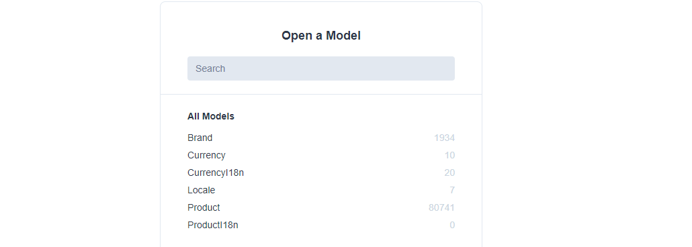

# Workshop Node SQL Server

A boilerplate project to play with sql server from nodejs. Don't use in production,
it basically allows workshop participants to try out different scenarios with sql server
(prisma or kysely or tedious ?). Exercises will be provided during the session.

## Getting started

> <details>
> <summary>Requirements: node 18+, corepack, yarn, docker. For Windows users WSL2 unbuntu recommended.</summary>
>
> ```bash
> nvm install v20  // if you don't have nodejs installed
> corepack enable
> npm i -g yarn 
> ```
> </details> 

### Clone the repository

```bash
git clone https://github.com/belgattitude/workshop-node-sql-server.git
cd workshop-node-sql-server
```
### Run the local database

In a new terminal:

```bash
docker compose -f ./docker/sql-edge/compose.yml up
```

### Create the database

```bash
yarn workspace @workshop/db-sqlserver run db-recreate-dev
yarn workspace @workshop/db-sqlserver run prisma-db-seed  
```
### Open the database studio

```bash
yarn workspace @workshop/db-sqlserver run prisma-studio  
```



## Documentation

### Repo structure

The monorepo is organized as follows:

```
.
├── apps
│   │── fastify-app
│   └── next-app       ✅ Nextjs 14+ / hono api / kysely.
├── docker
│   └── sql-edge       ✅ compose.yaml
└── packages
    └── db-sqlserver   ✅ Manages database creation, types and seeds
```

### Launch Nextjs

> The app we'll use during the workshop

```bash
cd apps/nextjs-app
yarn dev
```

Check out the [Nextjs app](apps/nextjs-app/README.md) for more details.

### @workshop/db-sqlserver

> The package responsible for database creation / ddl / seeds and types generation.

Check out the [@workshop/db-sqlserver](packages/db-sqlserver/README.md) for more details.

## Sponsors

If my OSS work brightens your day, let's take it to new heights together!
[Sponsor](<[sponsorship](https://github.com/sponsors/belgattitude)>), [coffee](<(https://ko-fi.com/belgattitude)>),
or star – any gesture of support fuels my passion to improve. Thanks for being awesome! 🙏❤️

## License

MIT © [belgattitude](https://github.com/belgattitude) and contributors.
