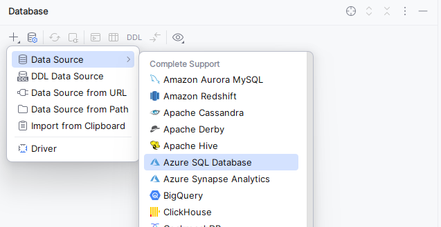
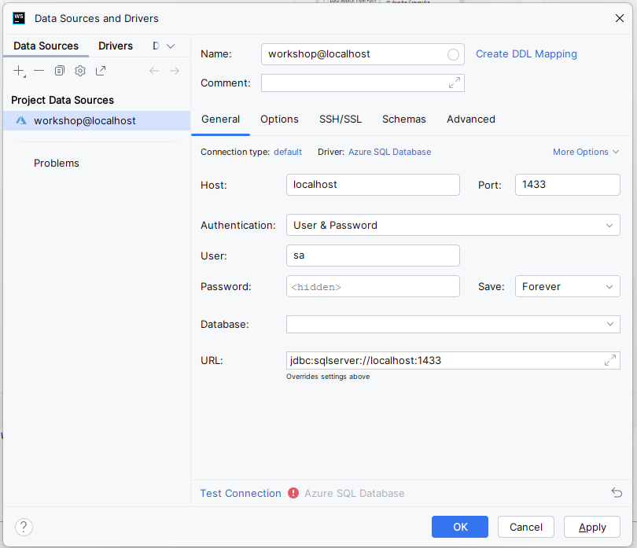
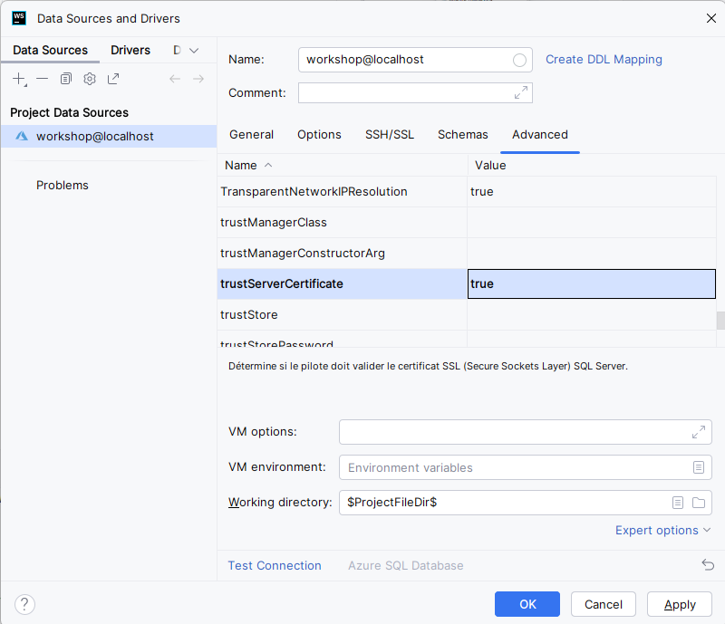
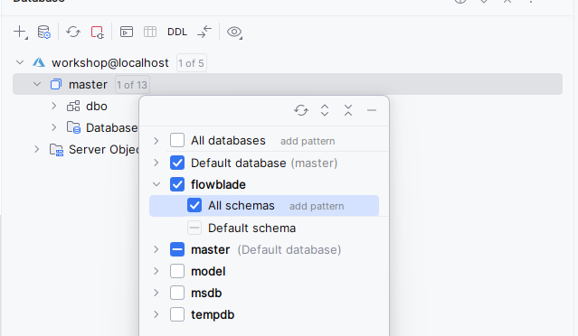
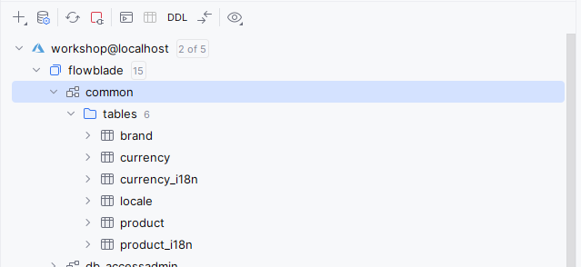

## Database tools

By default the docker database runs on 

- localhost:1433
- database=flowblade
- user=sa
- password=FlowbladeSADev123
- trustServerCertificate=true
- encrypt=false

### Jetbrains

